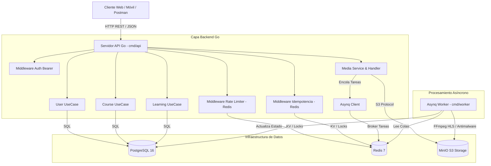
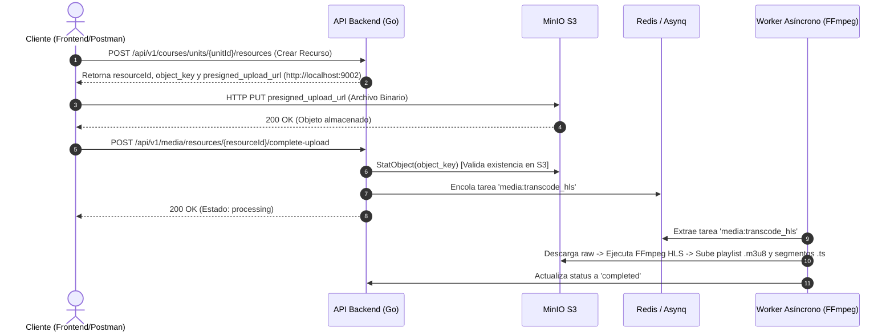
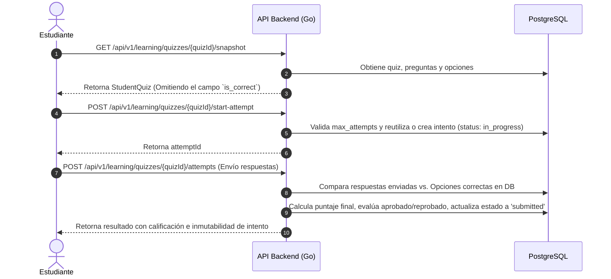
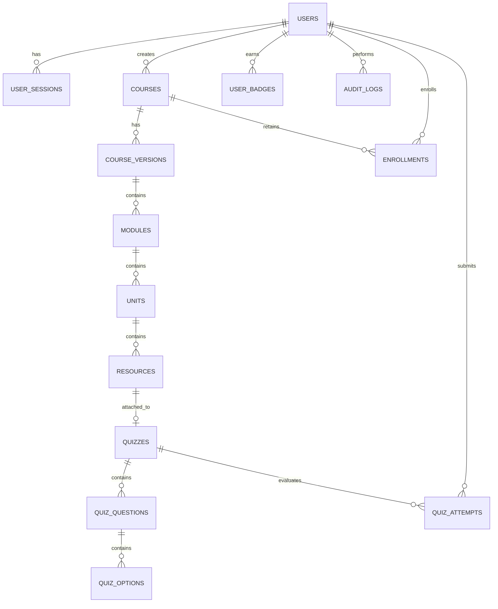

# 🏛️ Informe de Arquitectura de Software — Plataforma MOOC

Este documento describe la arquitectura de software, patrones de diseño, esquema de persistencia, flujos de procesamiento y decisiones técnicas de la **Plataforma Web de Cursos Masivos Abiertos en Línea (MOOC)**.

---

## 📚 1. Visión General del Sistema

El backend de la plataforma MOOC está diseñado como un **Monolito Modular** escrito en **Go (Golang)**, acoplado con **Trabajadores Asíncronos (Async Workers)** impulsados por **Redis y Asynq**. El sistema proporciona una API RESTful escalable y resiliente capaz de gestionar la autoría de cursos, control de versiones inmutables, reproducción multimedia con transcodificación HLS adapativa, evaluación con calificación server-side, seguimiento de progreso y emisión de insignias digitales verificables.

### 🛠️ Stack Tecnológico

| Componente | Tecnología | Propósito |
| :--- | :--- | :--- |
| **Lenguaje Backend** | Go 1.25 | Alto rendimiento, concurrencia nativa y bajo consumo de memoria. |
| **Router HTTP** | Chi v5 | Enrutador ligero, de alto rendimiento y compatible con `net/http`. |
| **Base de Datos Relacional**| PostgreSQL 16 | Almacenamiento primario ACID para usuarios, cursos, quizzes y progreso. |
| **Caché y Colas** | Redis 7 + Asynq | Limitación de tasa (Rate Limiting), Idempotencia y colas de tareas asíncronas. |
| **Almacenamiento S3** | MinIO (S3 Compatible) | Almacenamiento de archivos multimedia, PDFs e insignias emitidas. |
| **Servidor de Correo** | Mailpit | Captura SMTP local para verificación de correo y restablecimiento de contraseña. |
| **Transcodificación** | FFmpeg | Conversión asíncrona de video/audio a segmentos streaming HLS (`.m3u8` / `.ts`). |
| **Contenedorización** | Docker & Docker Compose | Orquestación completa del stack de desarrollo y producción. |
| **Especificación API** | OpenAPI 3.1 / Swagger UI | Especificación formal y documentación interactiva expuesta en `/docs/`. |

---

## 📐 2. Principios de Diseño e Invariantes del Dominio

1. **Separación Limpia de Dominios (Clean Architecture)**:
   - El código se organiza en dominios independientes (`user`, `course`, `media`, `learning`) con contratos claros mediante interfaces en `internal/domain`.

2. **Inmutabilidad de Versiones Publicadas**:
   - Una versión de curso con estado `published` jamás se modifica in-place para preservar la integridad del aprendizaje de los estudiantes inscritos.
   - Cualquier actualización requiere invocar `/create-draft`, lo que duplica la jerarquía creando un borrador (`draft`) que mantiene **IDs estables (`stable_id`)** para reanudar el progreso sin pérdidas.

3. **Carga Directa a Almacenamiento S3 (Direct-to-S3 Upload)**:
   - El backend **no actúa de proxy** para los archivos pesados de video/audio. En su lugar, emite URLs de subida prefirmadas (`presigned_upload_url`) con firmas AWS SigV4 adaptadas al host externo (`http://localhost:9002`), permitiendo a los clientes realizar cargas binarias `PUT` directamente a MinIO.

4. **Evaluaciones con Calificación 100% Server-Side**:
   - La estructura entregada a los estudiantes (`StudentQuizOption`) excluye estrictamente el campo `is_correct`.
   - La evaluación de respuestas y asignación de notas se realiza exclusivamente en el servidor al momento del envío del intento, generando registros inmutables de calificación.

5. **Resiliencia de Progreso e Insignias Verificables**:
   - La permanencia en servidor se calcula validando pulsos periódicos (`/heartbeat`). Al completar el 100% de recursos obligatorios y aprobar los quizzes, el sistema genera de forma automática un certificado/insignia con UUID público verificable.

---

## 🧱 3. Arquitectura de Componentes



---

## 🗂️ 4. Estructura de Paquetes y Módulos Go

```text
backend/
├── cmd/
│   ├── api/             # Punto de entrada HTTP, inicialización de dependencias y rutas Chi
│   └── worker/          # Proceso daemon que consume colas de Asynq (HLS / Antimalware)
├── docs/                # OpenAPI 3.1 specification (openapi.yaml)
├── internal/
│   ├── config/          # Carga de variables de entorno y defaults
│   ├── domain/          # Modelos de dominio, interfaces de repositorios y errores
│   ├── user/            # Autenticación, sesiones, roles y administración de usuarios
│   ├── course/          # Jerarquía de cursos, módulos, unidades, recursos y borrador/publicado
│   ├── media/           # Integración con MinIO S3, presigned URLs y streaming
│   ├── learning/        # Inscripciones, quizzes server-side, heartbeat de progreso e insignias
│   ├── middleware/       # Autenticación Bearer, Rate Limiting, Idempotencia, Security Headers
│   └── worker/          # Manejadores de tareas asíncronas de Asynq
└── migrations/          # Archivos de migración SQL ordenados (.up.sql)
```

---

## 🔄 5. Flujos de Secuencia Clave

### 5.1 Pipeline Multimedia S3 Direct-to-Upload y Streaming HLS



---

### 5.2 Evaluación con Snapshot Seguro y Calificación Server-Side



---

## 📊 6. Modelo de Datos Relacional (PostgreSQL)



### Tablas Principales:
- `users`: Cuentas con roles (`admin`, `teacher`, `student`), hash bcrypt de contraseña y estado.
- `user_sessions`: Tokens Bearer activos para revocación rápida en sesión/logout.
- `courses` & `course_versions`: Jerarquía de cursos con `current_published_version_id` y estados (`draft`, `published`, `archived`).
- `modules`, `units`, `resources`: Jerarquía con `stable_id` inmutable entre versiones.
- `quizzes`, `quiz_questions`, `quiz_options`: Definición de evaluaciones y claves de respuesta.
- `quiz_attempts`: Intentos registrados con respuestas enviadas, puntaje obtenido y estado.
- `enrollments` & `student_progress`: Progreso del estudiante por recurso y pulso de permanencia.
- `user_badges`: Insignias obtenidas con código de verificación UUID único e inmutable.
- `audit_logs`: Registro inmutable de acciones administrativas y mutaciones del sistema.

---

## 🔒 7. Seguridad, Resiliencia y Control de Acceso

1. **Autenticación Bearer & Gestión de Sesiones**:
   - Headers HTTP estándar `Authorization: Bearer <token>`. Las sesiones se contrastan contra `user_sessions` en PostgreSQL, permitiendo invalidar inmediatamente tokens activos al ejecutar `POST /api/v1/auth/logout`.

2. **Rate Limiting Dinámico (Redis)**:
   - Aplicado a rutas de autenticación y públicas para prevenir ataques de fuerza bruta y denegación de servicio.

3. **Garantía de Idempotencia**:
   - Middleware que evalúa el header `Idempotency-Key` en operaciones de mutación (`POST`, `PUT`, `PATCH`) mediante locks con expiración en Redis, previniendo la duplicación de cobros o registros en reintentos de red.

4. **Encabezados de Seguridad (SecurityHeaders)**:
   - Inyección de cabeceras de protección Web (`X-Content-Type-Options: nosniff`, `X-Frame-Options: DENY`, `X-XSS-Protection`, `Content-Security-Policy`).

5. **Auditoría de Acciones (Audit Trail)**:
   - Cualquier acción administrativa (creación de profesores, cambio de estado de usuario, revocación de insignias) genera un registro inmutable en `audit_logs` con IP, user-agent, admin_id y payload.

6. **Escalamiento horizontal sin estado local**:
   - `api` y `worker` no guardan estado en el filesystem del contenedor (persistencia en PostgreSQL, archivos en MinIO, colas/locks en Redis), por lo que ambos escalan a múltiples instancias con `docker compose up --scale api=N --scale worker=M` sin coordinación adicional. `nginx` expone un único puerto de host y reparte el tráfico entre las réplicas de `api` vía el DNS interno de Docker. Detalle y comando exacto en [`docs/OPERACIONES.md`](docs/OPERACIONES.md).

7. **Backup y recuperación de PostgreSQL (RPO ≤ 15 min, RTO ≤ 4 h)**:
   - `scripts/backup/backup_postgres.sh` toma `pg_dump` periódicos (programado cada 10 min) y `scripts/backup/restore_postgres.sh` restaura desde cualquiera de esos dumps, verificando al final el conteo de filas. Procedimiento completo, objetivo de RPO/RTO y evidencia de una restauración real (con pérdida de datos simulada) en [`docs/OPERACIONES.md`](docs/OPERACIONES.md).

8. **Validación exhaustiva de publicación y autosave estable**:
   - `PublishVersion` recorre toda la jerarquía y junta **todos** los problemas que impiden publicar (curso sin título/resumen, `passing_score` ≤ 0, módulos sin unidades, unidades sin recursos, recursos visibles con procesamiento fallido, falta de recurso publicable) en un único `PublishValidationError`, devuelto completo en `details` por `POST .../publish` — antes se cortaba en el primer problema encontrado.
   - Se agregó `PATCH /resources/{id}/autosave`, que guarda solo `title`/`canonical_markdown` y marca `last_autosaved_at`, sin tocar nunca `is_visible`/`is_mandatory`/`is_downloadable`/`position`/`processing_status`. Esto corrige un bug real: el `PUT` de recursos decodificaba el payload directo a `domain.Resource`, y como los booleanos no tienen forma de distinguir "no vino en la petición" de "vino en `false`", cualquier guardado parcial apagaba `is_visible` y compañía — la causa concreta del "autosave inestable" señalado por la rúbrica.
   - Evidencia (`go test ./internal/course/... -v`, vía `docker build --target builder` + `docker run`, 2026-10-07):
     ```
     === RUN   TestCoursePublicationValidation
     --- PASS: TestCoursePublicationValidation (0.00s)
     === RUN   TestAutosaveDoesNotResetVisibility
     --- PASS: TestAutosaveDoesNotResetVisibility (0.00s)
     PASS
     ok      github.com/mooc-platform/backend/internal/course        0.003s
     ```
     `TestAutosaveDoesNotResetVisibility` es la prueba de regresión del bug descrito arriba; `TestCoursePublicationValidation` ahora exige que el error de publicación traiga al menos 2 problemas distintos cuando faltan varios a la vez.

9. **E2E reales, lint, análisis de seguridad y observabilidad en CI**:
   - `tests/e2e/critical_flows_test.go` (build tag `e2e`) dejó de usar `mockE2ERepo` en memoria: ahora es un cliente HTTP real que recorre 9 flujos críticos (salud, registro, verificación de correo, login, autoría de jerarquía de curso, rechazo de publicación con lista exhaustiva de errores, publicación exitosa + catálogo, inscripción + heartbeat, envío de quiz + rechazo de reenvío duplicado) contra el stack **desplegado** (API + Postgres + Redis + MinIO vía Docker Compose), apuntando a `nginx` en vez de a un doble. Se corre con `docker compose --profile test run --rm e2e-tests` (servicio nuevo en `docker-compose.yml`, reutiliza el target `builder` del `Dockerfile` para no requerir Go instalado localmente).
   - `.github/workflows/ci.yml` ahora tiene 5 jobs: `test` (build+unitarias, igual que antes), `lint` (`golangci-lint`), `security` (`gosec`, sube el reporte SARIF como artifact), `e2e` (levanta el stack completo con Docker Compose y corre la suite anterior) y `postman` (corre `postman_collection.json` con `newman` contra el stack real y sube el reporte HTML/JUnit como artifact de CI — antes la colección existía pero no se ejecutaba de forma automatizada ni dejaba evidencia guardada).
   - Se agregó `GET /metrics` (`internal/middleware/metrics.go`) con contadores en formato Prometheus (`http_requests_total`, `http_request_duration_seconds_sum`, `http_requests_errors_total`), sin dependencias nuevas de Go. La correlación por `request_id` y el logging de acceso **ya existían** antes de este trabajo (middlewares propios de chi: `RequestID`, `Logger`); lo que faltaba y se documenta en [`docs/OPERACIONES.md`](docs/OPERACIONES.md), sección "Observabilidad", es el endpoint de métricas y un ejemplo de regla de alerta.
   - Evidencia real (`docker compose --profile test run --build --rm e2e-tests`, 2026-10-07): la primera corrida encontró un bug genuino (abajo); corregido, la siguiente corrida pasó completa:
     ```
     --- PASS: TestE2ECriticalFlows (0.28s)
         --- PASS: TestE2ECriticalFlows/01_health_check (0.00s)
         --- PASS: TestE2ECriticalFlows/02_registro_estudiante (0.09s)
         --- PASS: TestE2ECriticalFlows/03_verificacion_email (0.01s)
         --- PASS: TestE2ECriticalFlows/04_login_y_sesion (0.07s)
         --- PASS: TestE2ECriticalFlows/05_autoria_jerarquia_curso (0.02s)
         --- PASS: TestE2ECriticalFlows/06_publicacion_rechazada_lista_exhaustiva (0.01s)
         --- PASS: TestE2ECriticalFlows/07_publicacion_exitosa_y_catalogo (0.01s)
         --- PASS: TestE2ECriticalFlows/08_inscripcion_y_heartbeat (0.02s)
         --- PASS: TestE2ECriticalFlows/09_quiz_envio_y_rechazo_doble_envio (0.03s)
     PASS
     ok      github.com/mooc-platform/backend/tests/e2e      0.287s
     ```
     Ver [`docs/OPERACIONES.md`](docs/OPERACIONES.md), sección "Observabilidad", para la evidencia de `/metrics` de esta misma corrida, incluyendo el bug real que la primera ejecución expuso (tipo de recurso inválido → 500 en vez de 400) y el hallazgo colateral de validación de entrada que quedó pendiente.
   - Evidencia real adicional (local, vía `docker compose run --build --rm e2e-tests go build ./...` y `go test -v ./...`, 2026-10-07): build limpio, `golangci-lint` con 0 issues (tras corregir ~45 hallazgos reales de errcheck/ineffassign/staticcheck en código pre-existente del proyecto — no eran falsos positivos), y las 7 pruebas unitarias pasando:
     ```
     --- PASS: TestCoursePublicationValidation (0.00s)
     --- PASS: TestAutosaveDoesNotResetVisibility (0.00s)
     ok      github.com/mooc-platform/backend/internal/course        0.002s
     --- PASS: TestServerSideQuizGrading (0.00s)
     --- PASS: TestHeartbeatProgressAndBadgeIssuance (0.00s)
     --- PASS: TestFullQuizLifecycle (0.00s)
     ok      github.com/mooc-platform/backend/internal/learning      0.002s
     --- PASS: TestRegisterAndVerifyStudent (0.12s)
     --- PASS: TestLastAdminProtection (0.04s)
     ok      github.com/mooc-platform/backend/internal/user  0.167s
     ```
   - Durante la implementación se encontró y resolvió un problema real de infraestructura (MinIO dejó de poder descargarse desde Docker Hub, se migró a RustFS) — ver [`docs/TROUBLESHOOTING.md`](docs/TROUBLESHOOTING.md) para el detalle completo, incluyendo la evidencia de la suite E2E (9/9) pasando de nuevo tras el fix.
   - _TODO: pegar aquí la salida real de los jobs `lint`/`security`/`postman`/`e2e` corriendo en GitHub Actions tras este fix, la primera vez que se ejecuten allí con éxito._

---

## 🚀 8. Verificación y Calidad de Código

El backend cuenta con una suite de pruebas unitarias por dominio (`go test ./...`, dobles en memoria — rápidas, para lógica de negocio) y una suite E2E real separada (`go test -tags=e2e ./tests/e2e/...`, HTTP contra el stack desplegado — ver punto 9 arriba) que no se mezclan: la primera no requiere Docker, la segunda sí.

```bash
# Pruebas unitarias/integración (dobles en memoria, sin stack levantado)
cd backend
go test -v ./...

# Pruebas E2E reales (requieren el stack de Docker Compose levantado)
docker compose up -d --build
docker compose --profile test run --rm e2e-tests
```

Pipeline de CI (`.github/workflows/ci.yml`): build + pruebas unitarias, lint (`golangci-lint`), análisis de seguridad estática (`gosec`), suite E2E contra el stack real, y ejecución de la colección Postman vía `newman` con reporte guardado como artifact — ver punto 9 arriba.
